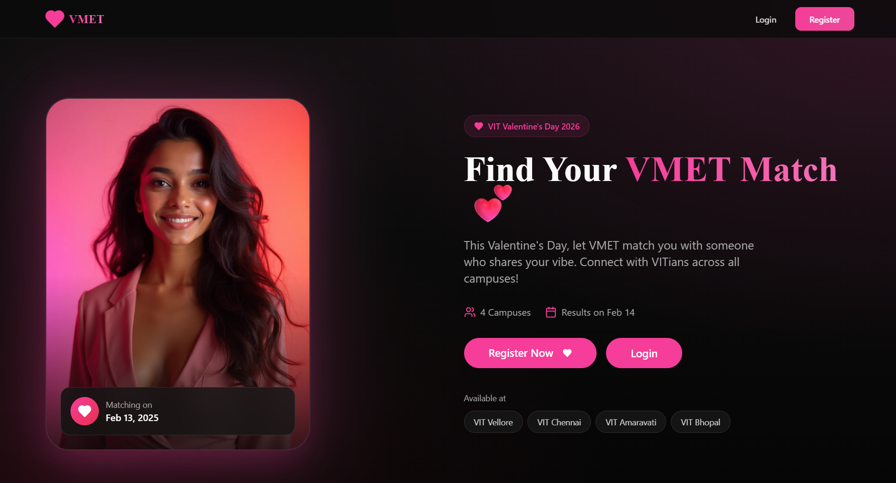
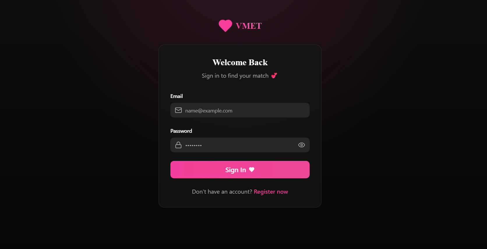

<div align="center">

# 💝 VMET — Find Your Match

**A Valentine's Day matchmaking platform for VIT students across all campuses.**

</div>

---

## 📸 Screenshots

|             Landing Page              |               Login               |
| :-----------------------------------: | :-------------------------------: |
|  |  |

---

## ✨ Features

- 🔐 **VIT-exclusive auth** — Only `@vitstudent.ac.in` emails can register
- 👤 **Rich profiles** — Bio, campus, gender, interests, and hobbies
- 💘 **Smart matching** — Campus-scoped, interest-compatible, shared-hobby matching
- 🛠️ **Admin panel** — Generate and reveal matches at `/admin`
- 📡 **Realtime updates** — Dashboard refreshes live when matches are revealed
- 📱 **Fully responsive** — Works seamlessly on mobile and desktop
- 🎨 **Sleek dark UI** — Built with shadcn/ui + Tailwind CSS

---

## 🚀 Tech Stack

| Layer      | Technology                       |
| ---------- | -------------------------------- |
| Frontend   | React + TypeScript + Vite        |
| Styling    | Tailwind CSS + shadcn/ui         |
| Backend    | Supabase (Postgres + Auth + RLS) |
| State      | TanStack Query + React Router    |
| Testing    | Vitest                           |
| Deployment | Vercel                           |

---

## 🏁 Getting Started

### 1. Clone & Install

```bash
git clone https://github.com/purplepot/cupid.git
cd cupid
npm install
```

### 2. Set up Environment Variables

Create a `.env.local` file at the root:

```env
VITE_SUPABASE_URL=https://<your-project>.supabase.co
VITE_SUPABASE_PUBLISHABLE_KEY=<your-anon-key>
VITE_ADMIN_EMAILS=admin1@vitstudent.ac.in,admin2@vitstudent.ac.in
```

> ⚠️ Vite reads env vars at **build time** — redeploy after any changes.

### 3. Configure Supabase RLS

Ensure the following Row Level Security policies exist:

**`profiles` table:**

- Users can `INSERT` / `UPDATE` / `SELECT` where `auth.uid() = user_id`

**`matches` table:**

- Users can `SELECT` their own rows
- Admins can `SELECT` / `INSERT` / `UPDATE` all rows
- Users can view their matched partner's profile when `revealed = true`

### 4. Run Locally

```bash
npm run dev
```

---

## 🧰 Scripts

| Command              | Description              |
| -------------------- | ------------------------ |
| `npm run dev`        | Start dev server         |
| `npm run build`      | Production build         |
| `npm run preview`    | Preview production build |
| `npm run lint`       | Run ESLint               |
| `npm run test`       | Run unit tests           |
| `npm run test:watch` | Run tests in watch mode  |

---

## 🔑 Admin Usage

1. Log in with an email listed in `VITE_ADMIN_EMAILS` (or a user with `app_metadata.role = admin`)
2. Navigate to `/admin`
3. Click **Generate Matches** to run the matching algorithm
4. Click **Reveal All** to make matches visible to users
5. Users see their match in real-time on the dashboard

---

## 💘 Matching Algorithm

The current algorithm uses a **greedy campus-scoped pairing** strategy:

1. Users are grouped by campus (VIT Vellore, Chennai, Amaravati, Bhopal)
2. Pairs must have **compatible interests**
3. Pairs must share **at least one hobby**
4. Each matched user gets a mirrored match row; reveal flips `revealed → true`

---

## 🚢 Deployment (Vercel)

1. Push to GitHub
2. Import the repo in [Vercel](https://vercel.com)
3. Add the three environment variables in Vercel's project settings
4. Deploy — Vercel auto-builds on every push to `main`

---

## 🐛 Troubleshooting

| Issue                            | Fix                                                |
| -------------------------------- | -------------------------------------------------- |
| Duplicate key on profiles        | Ensure upsert uses `onConflict: user_id`           |
| Can't see partner after reveal   | Check partner-view RLS policy + `revealed = true`  |
| Admin button missing on mobile   | Hard refresh after deploy                          |
| Admin access fails in production | Re-check env vars and log in fresh for updated JWT |

---

## 🌐 Campuses

VMET is available across all four VIT campuses:

- 🏫 VIT Vellore
- 🏫 VIT Chennai
- 🏫 VIT Amaravati
- 🏫 VIT Bhopal

---

<div align="center">

Made with 💕 for VIT Valentine's Day 2026

</div>
